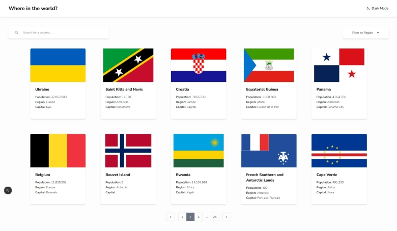

# Countries App built with RESTful API

A fully responsive and performant web application for exploring detailed information about countries worldwide. Built with **Next.js**, **Tailwind CSS**, and the **REST Countries API**, this project takes advantage of **server‑side rendering (SSR)** to deliver fast load times, improved SEO, and a smooth user experience. It also includes a complete testing setup using **Jest** and **React Testing Library** to ensure reliability and maintainability.

## Table of Contents

- [Overview](#overview)
  - [The challenge](#the-challenge)
  - [Screenshots](#screenshots)
  - [Links](#links)
- [My process](#my-process)
  - [Built with](#built-with)
  - [Project structure](#project-structure)
  - [Build strategy](#build-strategy)
  - [Useful resources](#useful-resources)
- [Acknowledgments](#acknowledgments)
- [Author](#author)

## Overview

### The Challenge

The goal of this project was to build a modern, performant countries explorer app that integrates multiple core features and best practices. Specifically, the challenge included:

- Implementing **server‑side rendering (SSR)** with Next.js for faster performance and improved SEO

- Fetching country data from a **RESTful API** and handling dynamic routes

- Building a **search input** to filter countries by name

- Adding a **region filter** to browse countries by geographic area

- Implementing **pagination** for smoother navigation through large datasets

- Supporting **dark mode** with a persistent theme toggle

- Writing **unit tests** with Jest and React Testing Library to ensure component reliability

### Screenshots




### Links

- Solution URL: [GitHub repo](https://github.com/BlackiePearlJoobi/rest-countries-api)
- Live Site URL: [Vercel](https://rest-countries-api-sigma-bice.vercel.app/)

## My process

### Built with

- **Semantic HTML + ARIA** – enhancing structure and accessibility for assistive technologies
- **Tailwind CSS** – utility-first framework for responsive, accessible UI design
- **TypeScript** – ensuring type safety and scalable logic
- **React (`useState`, `useEffect`)** – component-level logic (primarily for theme handling)
- **Next.js** – powering server‑side rendering, routing, and optimized performance
- **RESTful API** – fetching real‑time country data from the REST Countries API
- **LocalStorage** – client-side persistence for dark/light mode preferences
- **Jest + React Testing Library** - unit and integration testing for rendering, search, and filtering
- **Vercel** – deployment platform for seamless CI/CD and global edge performance

### Project Structure

This project follows a modular structure leveraging **Next.js App Router**, with clear separation of concerns between layout, data, components, and styling. Below is a breakdown of key folders and files:

<pre>
app/
├── __tests__ // Unit and integration test suite for rendering, search, and filtering
│ └── fixtures/ // Mock countries data used across tests
├── countries/ // Dynamic routes for country pages
│ └── [code]/ // Server-rendered country detail pages
├── components/ // Reusable UI components (Header, Pagination, Switch, BackButton, etc.)
├── fonts/ // Custom font imports and configurations
├── types/definitions.ts // Shared TypeScript types and interfaces
├── global.css // Tailwind base styles and custom overrides
├── layout.tsx // Global layout wrapper (includes Header)
└── page.tsx // Homepage layout and all-countries list

__mock__/next/navigation.ts // Mock implementation of Next.js routing utilities for test isolation

public/assets/ // Static image assets used throughout the site
</pre>

### Build Strategy

This project was developed with a focus on performance, accessibility, and maintainable architecture. I structured the application around modular components and server‑side rendering to ensure fast, SEO‑friendly country pages. Key strategies included:

1. Dynamic Routing with App Router and REST Countries API Integration
2. Pagination for Large Data Sets
3. Dark Mode on the Server Side
4. Unit & Integration Testing

#### 1. Dynamic Routing with App Router and REST Countries API Integration

The directory structure `app/countries/[code]` enables intuitive, scalable routing for country detail pages. Each page is server‑rendered, ensuring fast initial loads and consistent SEO benefits.

For example, the dynamic route `app/countries/[code]/page.tsx` fetches data directly from the REST Countries API based on the code parameter:

```tsx
const CountryPage = async ({
  params,
}: {
  params: Promise<{ code: string }>;
}) => {
  const code = (await params).code.toUpperCase();

  const response = await fetch(
    `https://restcountries.com/v3.1/alpha/${code}?fields=cca3,flags,name,population,region,subregion,capital,tld,currencies,languages,borders`,
  );
  const country: Country = await response.json();

  if (!country) {
    notFound();
  }
  ...
};
```

This approach keeps data fetching on the server, reduces client‑side overhead, and ensures each country page is generated with the most up‑to‑date information.

#### 2. Pagination for Large Data Sets

To keep the countries list performant and easy to navigate, the app uses **query‑based pagination**. This avoids loading all countries at once and ensures that page transitions remain fast and accessible, and fully compatible with server‑side rendering.

The Pagination component reads the current URL parameters, updates the `page` value, and generates new links **without triggering a full page reload**. This works seamlessly with the App Router’s built‑in routing utilities.

Example: `app/components/Pagination.tsx`

```tsx
export default function Pagination({
  currentPage,
  total,
  itemsPerPage,
}: {
  currentPage: number;
  total: number;
  itemsPerPage: number;
}) {
  const totalPages = Math.ceil(total / itemsPerPage);
  const pathname = usePathname(); // returns the current route path without query params (e.g., '/', '/country', etc.)
  const searchParams = useSearchParams(); // returns an immutable ReadonlyURLSearchParams object that would look like: {page: '1', region: 'Americas'}
  const allPages = generatePagination(currentPage, totalPages); //array

  const createPageLink = (newPage: number | string): string => {
    const params = new URLSearchParams(searchParams); // creates a mutable clone and provides utility methods for manipulating the URL query parameters
    params.set("page", String(newPage));
    return `${pathname}?${params.toString()}`; // would look like "/?region=Asia&page=2"
    // The URL is updated without reloading the whole page
  };

  return (
    <nav aria-label="Pagination" className="flex...">
      {currentPage > 1 && (
        <PaginationArrow
          href={createPageLink(currentPage - 1)}
          direction="left"
        ></PaginationArrow>
      )}

      <ul className="flex...">
        {allPages.map((page, index) => {
          let position: "first" | "last" | "single" | "middle" | undefined;

          if (index === 0) position = "first";
          if (index === allPages.length - 1) position = "last";
          if (allPages.length === 1) position = "single";
          if (page === "...") position = "middle";

          return (
            <PaginationNumber
              key={`${page}-${index}`}
              href={createPageLink(page)}
              page={page}
              position={position}
              isActive={currentPage === page}
            />
          );
        })}
      </ul>

      {currentPage < totalPages && (
        <PaginationArrow
          href={createPageLink(currentPage + 1)}
          direction="right"
        ></PaginationArrow>
      )}
    </nav>
  );
}
```

The pagenation buttons are generated dynamically based on the total number of pages:

```tsx
const generatePagination = (currentPage: number, totalPages: number) => {
  // If the total number of pages is 7 or less, display all pages without any ellipsis.
  if (totalPages <= 7) {
    return Array.from({ length: totalPages }, (_, i) => i + 1);
  }

  // If the current page is among the first 3 pages, show the first 3, an ellipsis, and the last page.
  if (currentPage <= 3) {
    return [1, 2, 3, "...", totalPages];
  }

  // If the current page is among the last 3 pages, show the first page, an ellipsis, and the last 3 pages.
  if (currentPage >= totalPages - 2) {
    return [1, "...", totalPages - 2, totalPages - 1, totalPages];
  }

  // If the current page is somewhere in the middle, show the first page, an ellipsis, the current page and its neighbors, another ellipsis, and the last page.
  return [
    1,
    "...",
    currentPage - 1,
    currentPage,
    currentPage + 1,
    "...",
    totalPages,
  ];
};
```

Each pagination item is styled according to its position and active state, and ARIA attributes such as `aria-label`, `aria-current` or `aria-hidden` are applied where appropriate:

```tsx
const PaginationNumber = ({
  page,
  href,
  isActive,
  position,
}: {
  page: number | string;
  href: string;
  position?: "first" | "last" | "middle" | "single";
  isActive: boolean;
}) => {
  const className = clsx(
    "h-10 w-10 flex items-center justify-center border border-gray-300 dark:border-gray-600",
    {
      "rounded-l-md": position === "first" || position === "single",
      "rounded-r-md": position === "last" || position === "single",
      "z-10 bg-gray-500 border-gray-400 text-white": isActive,
      "hover:bg-gray-300 dark:hover:bg-gray-600":
        !isActive && position !== "middle",
      "border-t-0 border-b-0": position === "middle",
    },
  );

  return (
    <li>
      {isActive ? (
        <div aria-current="page" className={className}>
          {page}
        </div>
      ) : position === "middle" ? (
        // Prevent screen readers from announcing “dot dot dot”
        <div aria-hidden="true" className={className}>
          {page}
        </div>
      ) : (
        <Link
          href={href}
          aria-label={`Go to page ${page}`}
          className={className}
        >
          {page}
        </Link>
      )}
    </li>
  );
};
```

This pattern keeps pagination logic simple, predictable, and fully SSR‑compatible. It also ensures that **pagination state is reflected in the URL**, making pages shareable, bookmark‑friendly, and easy to navigate.

#### 3. Dark Mode on the Server Side

This project uses Tailwind CSS v4's `dark` variant to enable dark mode without pushing the entire app into client‑side rendering. Unlike a Context‑based theme solution, this approach keeps the app fully server‑rendered, with only the toggle switch implemented as a Client Component.

```css
// `globals.css`
@custom-variant dark (&:where(.dark, .dark *));
```

This custom variant overrides Tailwind’s default OS‑based dark mode (​​​`​prefers-color-scheme`​ ​ media query) and switches to a class‑based strategy. Any element becomes “dark‑mode aware” when a `.dark` class exists somewhere above it in the DOM.

The theme is restored **before hydration** using a minimal inline `<script>`:

```tsx
// `app/layout.tsx`
export default function RootLayout({
  children,
}: Readonly<{
  children: React.ReactNode;
}>) {
  return (
    <html lang="en" suppressHydrationWarning>
      <head>
        <script
          dangerouslySetInnerHTML={{
            __html: ` if (localStorage.theme === 'dark') { document.documentElement.classList.add('dark'); } `,
          }}
        />
      </head>
      <body className="antialiased bg-(--gray-50) dark:bg-(--blue-950) text-(--gray-950) dark:text-(--white)">
        <div className="w-full...">
          <Header></Header>
          {children}
        </div>
      </body>
    </html>
  );
}
```

The toggle switch updates both the DOM and `localStorage`:

```tsx
// `Switch.tsx`
"use client";

const Switch = () => {
  const isDarkInitial = document.documentElement.classList.contains("dark");

  const [isDark, setIsDark] = useState(isDarkInitial); // used only for this Switch component

  const toggleDarkMode = () => {
    const html = document.documentElement;
    const nowDark = html.classList.toggle("dark"); // If .dark is present → remove it → returns false; If .dark is absent → add it → returns true; So nowDark is always the new theme state.

    setIsDark(nowDark);
    localStorage.theme = nowDark ? "dark" : "light";
  };

  return (
    <button
      type="button"
      onClick={toggleDarkMode}
      className="flex..."
    >
      <Image src={...}></Image>
      <p>{isDark ? "Light Mode" : "Dark Mode"}</p>
    </button>
  );
};
```

Render flow:

1. Server renders the entire document, including `<html>` and `<body>`
2. The browser receives HTML and immediately executes the inline `<script>`
3. The script applies `.dark` before hydration, preventing flashes of incorrect theme
4. React hydrates only the `Switch` component (no hydration of the whole tree)

This pattern aligns with Vercel’s recommended RSC‑first architecture and keeps dark mode fully compatible with server rendering.

#### 4. Unit & Integration Testing

Testing focused on ensuring that page rendering, search behavior, region filtering, and pagination all work reliably across server and client components. Because Next.js server components rely on `fetch`, additional setup was required to make tests run correctly in Jest.

##### Mocking `fetch`

The Next.js server components such as `app/page.tsx` and `app/countries/[code]/page.tsx` call `fetch`:

```tsx
await fetch("https://restcountries.com/v3.1/all?...");
```

However, Jest run in a Node environment, which **does not provide a built‑in `fetch`**. Without a mock, tests fail with: `ReferenceError: fetch is not defined`.

To solve this, `fetch` is mocked globally and replaced with a function that returns fake data. About 40 mock countries were needed for the tests, so a dedicated `countries.fixture.ts` file was created inside `__tests__/fixtures`.

Because Jest automatically looks for tests inside every file under `__tests__`, the fixtures folder must be excluded to avoid false failures:

```ts
// jest.config.ts
const config: Config = {
  ...
  testPathIgnorePatterns: ["/fixtures/"],
};
```

The mock implementation:

```ts
// test.tsx
beforeAll(() => {
  global.fetch = jest.fn(() =>
    Promise.resolve({
      json: () => Promise.resolve(mockCountries),
    }),
  ) as jest.Mock;
});
```

How this works:

1. `beforeAll(() => { ... })` - Runs once before all tests in the file, ensuring the mock is ready before any component calls `fetch`.
2. `global.fetch = ...` - Overrides the missing Node `fetch` with a custom mock.
3. `jest.fn(() => ...)` - Creates a mock function that behaves like `fetch`.
4. `Promise.resolve({ ... })` - Mimics the real `fetch API`, which returns a `Promise<Response>`.
5. `json: () => Promise.resolve([...])` - Simulates the `.json()` method on a real `Response` object, returning the mock countries array.(\*)
6. `as jest.Mock` - Ensures correct TypeScript typing for the mocked function.

\*In the server components:

```tsx
const response = await fetch(...)
const countries = await response.json()
```

So the mock function must behave the same way:

- `fetch()` returns an object
- that object has a `.json()` method
- `.json()` returns a `Promise`
- that `Promise` resolves to the array of fake countries

### Useful Resources

- [Next.js 15 Full Tutorial Playlist – Codevolution](https://www.youtube.com/playlist?list=PLC3y8-rFHvwhIEc4I4YsRz5C7GOBnxSJY)
  - [Episode 8 – Nested Dynamic Routes](https://www.youtube.com/watch?v=edrJf0GKfAI)

- [Tailwind CSS Cheat Sheet – Nerdcave](https://nerdcave.com/tailwind-cheat-sheet)

- [Dark mode – Tailwind CSS Official Documentation](https://tailwindcss.com/docs/dark-mode)

- [初心者でも安心！REST APIの基礎と実践的な使い方 - Qiita](https://qiita.com/inokage/items/fae28aea3d6710d7baca)

- [0からREST APIについて調べてみた - Qiita](https://qiita.com/masato44gm/items/dffb8281536ad321fb08)

## Acknowledgments

This is a solution to the [REST Countries API with color theme switcher challenge on Frontend Mentor](https://www.frontendmentor.io/challenges/rest-countries-api-with-color-theme-switcher-5cacc469fec04111f7b848ca). Frontend Mentor challenges help you improve your coding skills by building realistic projects.

## Author

- Frontend Mentor - [@BlackiePearlJoobi](https://www.frontendmentor.io/profile/BlackiePearlJoobi)
